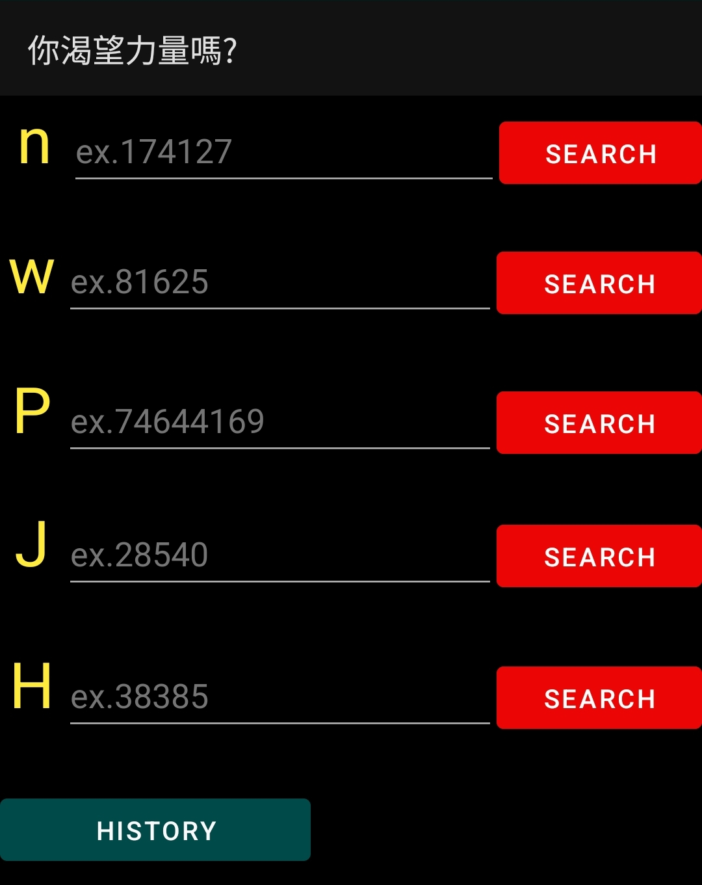

# ThirdAndroid
This is an open-source offline Android software, designed as a user-friendly GOD code navigation tool.

The screenshot below is the example. 

## Features
**Automatic GOD Code Navigation**: Enter a GOD code to automatically open the corresponding website and URL in the browser.  
**Example**: Enter 174127 in the n field -> The browser opens https://nh*ntai.net/g/174127

## Getting started
Choose a version in the release section, download the corresponding APK file, install it on your device, and remember to enable the installation of unknown sources in the settings.
